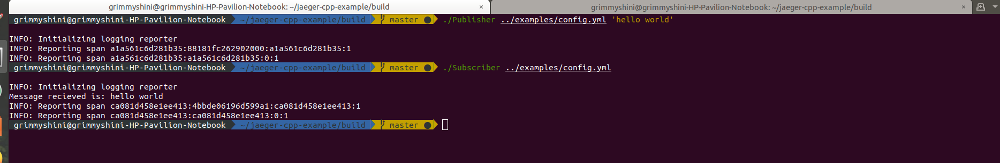
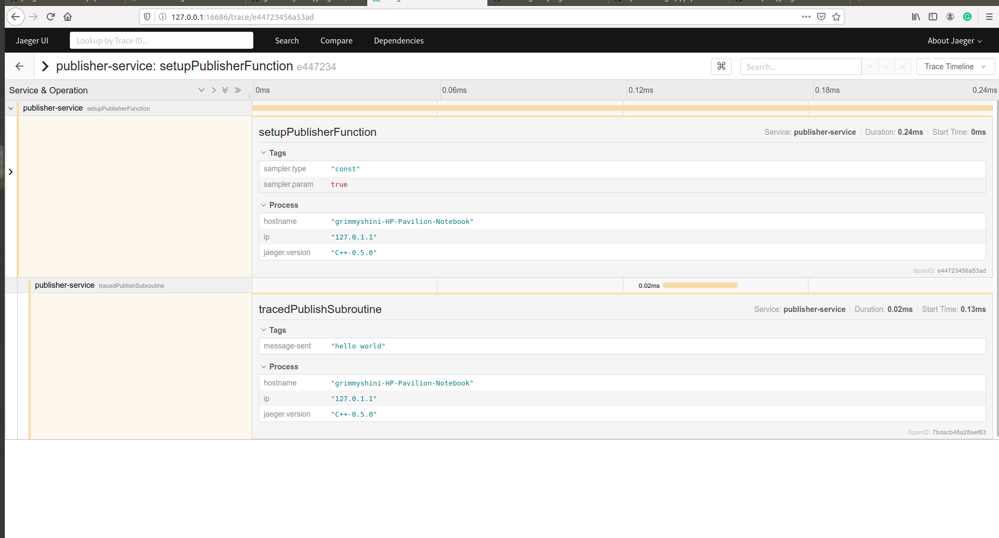
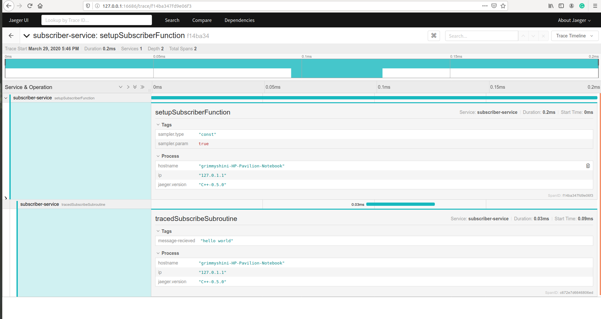

[![Build Status][ci-img]][ci] [![Coverage Status][cov-img]][cov] [![Appveyor Build][appveyor]][appveyor] [![OpenTracing 1.0 Enabled][ot-img]][ot-url]

# jaeger-client-cpp
C++ OpenTracing binding for [Jaeger](https://www.jaegertracing.io/)

## Contributing

Please see [CONTRIBUTING.md](CONTRIBUTING.md).

## Building

jaeger-client-cpp is built using CMake. It will automatically download
needed dependencies using [Hunter](https://docs.hunter.sh/en/latest/).

To build:

```bash
    mkdir build
    cd build
    cmake ..
    make
```

After building, the example [publisher](./examples/Publisher.cpp) and [subscriber](./examples/Subscriber.cpp) program can be run
with:

```bash
    ./Publisher ../examples/config.yml 'hello world'
    ./Subscriber ../examples/config.yml
```
The traces of the publisher and subscriber can then be observed via the Jaeger UI.

### Screenshots







## License 

[Apache 2.0 License](./LICENSE).

[ci-img]: https://travis-ci.org/jaegertracing/jaeger-client-cpp.svg?branch=master
[ci]: https://travis-ci.org/jaegertracing/jaeger-client-cpp
[appveyor]: https://ci.appveyor.com/api/projects/status/bu992qd3y9bpwe7u?svg=true
[cov-img]: https://codecov.io/gh/jaegertracing/jaeger-client-cpp/branch/master/graph/badge.svg
[cov]: https://codecov.io/gh/jaegertracing/jaeger-client-cpp
[ot-img]: https://img.shields.io/badge/OpenTracing--1.0-enabled-blue.svg
[ot-url]: http://opentracing.io
